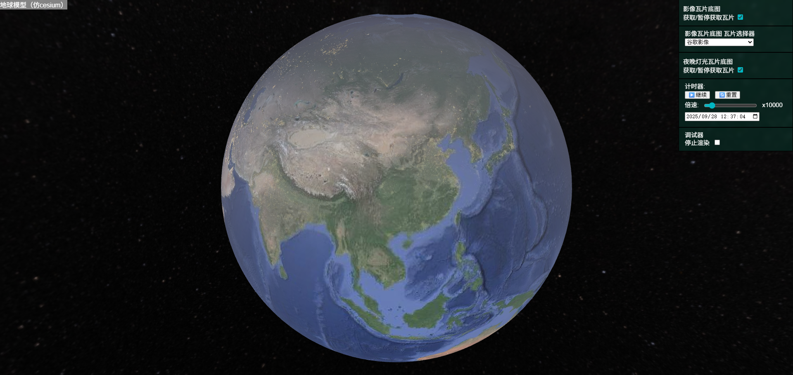

# TinyEarth

A Cesium-like 3D Earth Visulization Based on WebGL

## Demo
https://wkgreat.github.io/tinyearth/




## Example

install tinyearth
```shell
yarn install tinyearth
```

webpack.config.js
```javascript
import { fileURLToPath } from 'url';
import path from 'path';
import HtmlWebpackPlugin from 'html-webpack-plugin';
import CopyWebpackPlugin from 'copy-webpack-plugin'

const __filename = fileURLToPath(import.meta.url);
const __dirname = path.dirname(__filename);

const webpackEntry = {
    app: './index.js'
}

const webpackPlugins = [
    new HtmlWebpackPlugin({
        template: './index.html'
    }),
    new CopyWebpackPlugin({
        patterns: [
            {
                from: 'node_modules/tinyearth/dist/assets',
                to: 'assets'
            }
        ]
    })
];

export default [{
    mode: 'development',
    context: __dirname,
    entry: webpackEntry,
    output: {
        filename: '[name].js',
        path: path.resolve(__dirname, 'dist')
    },
    resolve: {
        extensions: ['.js'],
    },
    devtool: 'eval-source-map',
    module: {
        rules: [
            {
                test: /\.css$/,
                use: ['style-loader', 'css-loader']
            }, {
                test: /\.(png|gif|jpg|jpeg|svg|xml)$/,
                use: ['url-loader']
            }
        ]
    },
    plugins: webpackPlugins,

    // development server options
    devServer: {
        static: {
            directory: path.join(__dirname, 'dist'),
        },
        compress: true,
        port: 9000
    }
}];

```

index.js
```html
<html>

<head>
    <title>Tinyearth</title>
</head>

<body>
    <canvas id="tinyearth-canvas"></canvas>
    <div id="tinyearth-helper-div"></div>
    <div id="tinyearth-status-bar">
        <label id="status-mouse-location">Mouse Position:</label>
        <input type="text" name="location" id="status-mouse-location-input">
    </div>
    </div>
    <ul id="tinyearth-contextMenu"></ul>
</body>

</html>
```

style.css
```css
body {
    font-family: Arial, sans-serif;
    margin: 0;
    padding: 0;
    color: white;
}

#tinyearth-helper-div {
    position: fixed;
    top: 0px;
    right: 0px;
}

#describe-div {
    position: fixed;
    left: 0px;
    background: rgba(1, 255, 200, 0.1);
    backdrop-filter: blur(5px);
    -webkit-backdrop-filter: blur(5px);
    border: 1px solid rgba(255, 255, 255, 0.2);
    font-size: 25px;
    display: flex;
    align-items: center;
    justify-content: flex-start;
}

#tinyearth-canvas {
    height: 100%;
    width: 100%;
}

#tinyearth-status-bar {

    background: rgba(1, 255, 200, 0.5);
    backdrop-filter: blur(5px);
    -webkit-backdrop-filter: blur(5px);
    border: 1px solid rgba(255, 255, 255, 0.5);

    position: fixed;
    left: 0px;
    bottom: 0px;
    display: flex;
    justify-content: center;
    align-items: center;
}

#tinyearth-status-bar input {
    vertical-align: middle;
    background-color: rgba(255, 255, 255, 0.5);
}

#status-mouse-location-input {
    width: 300px;
}

#tinyearth-contextMenu {
    position: absolute;
    display: none;
    background: #fff;
    border: 1px solid #ccc;
    list-style: none;
    padding: 0;
    margin: 0;
    box-shadow: 2px 2px 6px rgba(0, 0, 0, 0.2);
    z-index: 1000;
}

#tinyearth-contextMenu li {
    padding: 0;
    cursor: pointer;
}
```

index.js
```javascript

import { TileResources } from 'tinyearth/tilesource';
import './styles.css'
import 'tinyearth/style.css'

import TinyEarth from 'tinyearth/tinyearth';
import TinyEarthHelper from 'tinyearth/helpers/tinyearth_helper';
import TimerHelper from 'tinyearth/helpers/timer_helper';
import ContextMenuTool from 'tinyearth/tools/context_menu';
import { MousePositionTool } from 'tinyearth/tools/mouse_position';
import { TinyEarthHelperContainer } from 'tinyearth/helpers/helper';
import TileProviderHelper from 'tinyearth/helpers/tileprovider_helper';

/*==================================
    create tinyearth and draw
==================================*/

const tinyearth = new TinyEarth({
    canvas: "tinyearth-canvas"
});

//offline tile
// const provider = tinyearth.addTileSource(TileResources.OFFLINE_IMAGERY);

//online google imagery
const provider = tinyearth.addTileSource(TileResources.GOOGLE_IMAGERY);

//start draw
tinyearth.draw();

/*==================================
    optional: add some tools
==================================*/
// context menu when right click
const contextMenu = new ContextMenuTool(tinyearth);
contextMenu.enable();

// mouse position tool
const mousePosTool = new MousePositionTool({
    tinyearth,
    contextMenu,
    textElementId: "status-mouse-location-input"
});
mousePosTool.enable();

/*==================================
    optional: add helper
==================================*/
// create the container of helpers
const helperContainer = new TinyEarthHelperContainer({
    id: "tinyearth-helper-div",
    tinyearth: tinyearth
});

// tinyearth basic helper
const tinyearthHelper = new TinyEarthHelper({ tinyearth });
helperContainer.addHelper(tinyearthHelper);

// the helper of a tile provider
const providerHelper = new TileProviderHelper({
    tinyearth,
    provider,
    title: "Tile Provider",
    enableTileSelector: true
});
helperContainer.addHelper(providerHelper);

// the timer helper
const timerHelper = new TimerHelper({ tinyearth });
helperContainer.addHelper(timerHelper);

```
